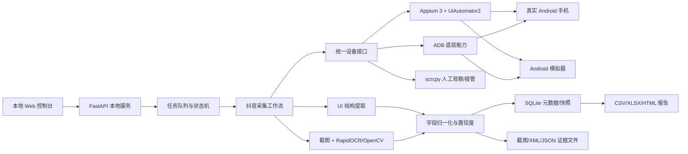

# 抖音竞品监测 Demo：技术架构与实施计划

> 本文保留为早期架构与实施过程记录，部分产品交互已经演进。当前支持范围、安装方式和实际使用流程以 [README.md](README.md) 为准。

版本：方案评审稿 0.1

日期：2026-08-20
状态：V0.1 骨架已实现；Redmi K80 Ultra 真机端到端采集已通过，进入字段扩展与稳定性验证

## 1. 已确定范围

- 第一阶段只支持抖音，运行平台只支持 macOS。
- 目标是竞品店铺监测，不做授权经营分析。
- 生产采集以真实 Android 手机为主；Android Studio 模拟器仅用于开发、回归测试和离线解析测试。
- 产品独立运行，不依赖 Codex、GPT 或其他大模型。
- OCR 默认可关闭；真机店铺卡场景建议启用 RapidOCR 本地运行。未来需要复杂识图或分析时，再通过可配置 API Key 接入可选大模型。
- 第一版只采集小范围、重要、页面公开展示且容易稳定获取的数据。
- 暂不尝试隐藏模拟器、修改设备指纹、破解 TLS、绕过验证码或自动处理风控页面。

重要的数据口径：竞品页面展示的“已售”“销量”等值属于平台公开展示值，不等于商家后台的真实订单、退款后销量或成交额。系统会同时保存原始文字、归一化数值、采集时间和证据截图，避免把估算值当成后台事实。

## 2. 推荐技术架构

### 2.1 应用层

- 后端：Python 3.10+、FastAPI、Pydantic。
- 前端：V0.1 先用零构建依赖的原生 HTML/JavaScript，本机浏览器访问；接口边界保持独立，后续可替换为 React + TypeScript + Vite 或 Tauri 壳。
- 依赖管理：`uv`，锁定所有版本，提供一键环境检查和启动脚本。
- 任务执行：本地单进程 worker + SQLite 任务表。先避免引入 Redis/Celery；增加多设备时再替换队列实现。
- 导出：CSV 为基础格式，XLSX 为主要交付格式，HTML 为首版分析报告。

选择本地 Web 应用而不是一开始做原生 macOS App，是为了减少打包复杂度，同时保留后续封装为 Tauri/macOS App 的空间。

已实现的工程取舍：V0.1 先把设备、状态机、证据、SQLite、导出和 Web API 跑通，再引入前端框架，避免把验证重点分散到打包和前端工程配置上。

### 2.2 设备控制层——整个方案的核心

采用三层组合，而不是把所有能力压在一个工具上：

1. **ADB：设备与进程底座**
   - 发现设备、检查授权和在线状态。
   - 启停应用、截图、读取屏幕尺寸、拉取诊断文件。
   - 在 Appium 会话失效时负责恢复应用和设备。

2. **Appium 3 + UiAutomator2：主要自动化引擎**
   - 通过文字、resource-id、content-description 和控件层级定位元素。
   - 支持真实设备和模拟器，共用同一套工作流。
   - 获取页面 XML、执行点击/滑动/输入，并在动作后验证页面状态。
   - Appium 的 UiAutomator2 是官方维护的 Android 驱动，适合作为长期核心，而不是只写坐标脚本。

3. **scrcpy：人工观察和接管**
   - 用于首次登录、验证码、风险提示和调试时的实时画面。
   - 不作为数据提取引擎，也不负责业务流程编排。

当前实现的取证优先级是 ADB 截图/XML、Appium 语义操作；当 UiAutomator2 的截图或页面源端点失效时，Appium 后端自动回退到 ADB。该设计是针对 Android 15 模拟器实测到的 UIA2 instrumentation 偶发崩溃，真机仍以 Appium 会话为主、ADB 为稳定证据底座。

系统内部定义统一的 `DeviceTarget` 接口，至少包含：

- 设备序列号、设备类型（真机/模拟器）、Android 版本。
- 屏幕尺寸、方向、缩放比例、应用包名和当前 Activity。
- `start_app`、`stop_app`、`screenshot`、`dump_ui`、`tap`、`swipe`、`type_text`、`back`、`health_check` 等能力。

所有采集流程只依赖该接口，不直接判断“这是真机还是模拟器”。因此：

- 真机负责正式登录和真实采集。
- 模拟器运行自建的测试页面、回归流程和异常恢复测试。
- 从真机录制的截图/XML 可在模拟器不登录时用于离线字段解析测试。
- 以后增加第二台手机或设备池时，不需要重写店铺和商品工作流。

### 2.3 页面操控设计

真机当前的最小闭环固定为：

1. 搜索关键词只负责得到候选结果，不直接把综合页商品当作店铺商品。
2. 点击搜索结果的“店铺”标签。
3. OCR 识别自绘店铺卡的完整名称和坐标；与用户提供的 `store_name` 做严格相等匹配。
4. 点击匹配店铺，确认出现“搜索本店商品 / 品牌 / 商品 / 分类”等店铺页标志。
5. 点击店铺页“商品”标签，再读取商品卡；滚动只发生在店铺商品页。

如果没有严格匹配的完整名称，任务进入 `store_selection_required` 暂停状态并保存候选名称，禁止自动选择相似店铺。当前版本固定商品查询以店铺页可见的商品标题为主，支持多个标题和价格区间筛选；抖音商品 ID/分享链接尚未在 UI 层稳定暴露，暂不作为首版必填。

产品交互使用“查询条件”模型：进入页面先显示“新增查询条件”，第一项先选择商品查询方式：查我收藏的产品、精准查询或范围查询。收藏方式是独立的全局商品范围，不要求店铺名，采集“我的 → 收藏 → 商品”并排除已失效、已下架和不可购买条目；精准/范围方式才显示一个严格店铺名。精准查询会持续翻页读取完整商品目录，在独立选择区提供搜索、当前列表全选和清空选择，保存店铺页标题作为稳定匹配键；范围查询使用综合、销量、上新、价格升序/降序和数量限制。新增时不要求命名，系统生成默认名称，保存后条件卡片折叠，点击编辑展开，名称通过独立重命名入口修改；一次运行可以勾选多个已保存条件，结果按条件分模块展示。数据层内部仍以 `QueryGroup` 表示单条查询条件，`store_name` 在收藏方式下为空，运行结果和历史/导出统一使用“查询范围”字段，不再假设每条结果必有店铺。当前已预留查询计划 `group_ids` 以及 `schedule_enabled` / `schedule_cron` 字段，后续定时器直接引用计划中的组 ID，不改变采集器接口。

每个页面以“状态”而不是固定坐标描述，例如：

- `DEVICE_READY`
- `LOGIN_REQUIRED`
- `HOME_READY`
- `SEARCH_RESULT`
- `SHOP_HOME`
- `PRODUCT_LIST`
- `PRODUCT_DETAIL`
- `RISK_CONTROLLED`
- `RECOVERING`

每一步动作包含四部分：

1. 页面签名：用多个文字、控件 ID 和视觉锚点确认当前页面。
2. 动作：点击、输入、滑动或返回。
3. 成功条件：目标页面签名出现，或者目标字段发生变化。
4. 失败处理：有限重试、回退、重启 App、暂停等待人工。

元素定位使用分级策略：

1. resource-id / content-description。
2. 可见文字与控件层级关系。
3. OCR 文字及文字框坐标。
4. 模板图片或归一化坐标，且只能作为最后兜底。

每次点击前重新读取页面，不长期复用旧坐标。每次滑动后验证列表确实变化，并用商品 ID、标题、价格等组合去重，避免无限滚动和重复采集。

Appium 真机每次任务先终止并重新激活抖音主界面，保留应用数据和登录态，避免 Android 恢复上次停留的店铺详情页；不会通过深链或网络接口绕过登录/风控。

### 2.4 数据获取策略

优先级如下：

1. **UI 层级数据**：速度快、字段位置明确，可直接获得文字和控件边界。
2. **本地 OCR**：用于自绘控件、视频覆盖层、图片文字或 UI 树缺失字段。当前 macOS 首选 RapidOCR，并保留文字坐标框用于严格店铺匹配。
3. **视觉模板**：识别图标、标签和页面状态，不直接承担大段文字识别。
4. **可选大模型视觉 API**：只处理难以规则化的页面理解，默认关闭，并设置单任务调用次数和费用上限。

V1 不把网络接口逆向或 HTTPS 中间人抓包作为主路径。这条路线容易受证书固定、协议变化、签名参数和版本升级影响，维护成本远高于 UI/OCR 采集。后续如果发现应用自身公开 WebView 中存在稳定、无需绕过保护的结构化数据，再单独增加 `NetworkExtractor` 插件。

### 2.5 存储与可追溯性

SQLite 保存：

- 店铺、商品、采集任务、页面快照、字段值、错误和运行状态。
- 每个字段的采集方式（UI/OCR/推断）、置信度、原始文字和归一化数值。
- 数据结构版本、抖音版本、设备信息和采集时间。

文件目录保存：

- 关键步骤截图。
- 原始 UI XML。
- 原始解析 JSON。
- 风控或失败现场的诊断包。

以后数据量增加时，可把历史快照同步为 Parquet，并使用 DuckDB 做分析；业务代码通过 repository 接口访问数据，避免和 SQLite 强绑定。

## 3. V1 采集字段

### 店铺

- 店铺名称、抖音号/页面可见标识。
- 认证/旗舰店标签、主营类目、简介。
- 粉丝数、获赞数、商品数量等页面可见指标。
- 店铺入口或可复用的页面标识。
- 采集时间和证据截图。

### 商品

- 商品标题、当前展示价、划线价。
- 页面展示销量/已售文字及归一化值。
- 商品评价数或评分（页面可见时）。
- 商品列表位置、商品 ID/分享链接（能够稳定取得时）。
- 商品详情页的主要规格和活动标签（小范围字段）。
- 采集时间和证据截图。

### 首版分析

- 商品数量、价格区间与价格分布。
- 展示销量 Top N 商品。
- 价格 × 展示销量的简单矩阵。
- 两次快照之间的新增商品、下架商品、价格变化和展示销量变化。

第一版本只有抖音，因此不计算“各平台占比”。等第二个平台接入后，再增加跨平台实体匹配和平台占比。

## 4. 基础抗风控与稳定性措施

这里的目标是降低异常和请求压力，不绕过平台安全控制：

- 固定一台真实设备、稳定网络和持久登录状态，避免频繁重新登录。
- 单账号单设备串行执行，不做并发扫店。
- 配置每小时/每日任务上限、页面间隔和最大滚动次数。
- 增量采集：已有商品只在到期或页面发生变化时复查。
- 缓存店铺和商品标识，任务支持断点续跑。
- 对网络失败和页面加载失败采用有限次数的指数退避。
- 检测验证码、异常登录、访问频繁、滑块和安全验证页面后立即暂停，由人工接管。
- 设备断线、锁屏、低电量、应用崩溃时自动保存现场并尝试有限恢复。
- 不使用代理池、批量账号、验证码平台、设备指纹伪造或自动绕过风控。

## 5. 工具选型对比

| 工具 | 定位 | 本项目结论 |
|---|---|---|
| Appium 3 + UiAutomator2 | Android 黑盒 UI 自动化、真机/模拟器共用 | 主自动化引擎 |
| ADB | 设备连接、应用生命周期、截图和恢复 | 必需底座 |
| scrcpy | macOS 上实时镜像和人工控制真机 | 登录、调试、人工接管 |
| Maestro | 简洁 YAML 流程和回归测试 | 可用于烟雾测试，不承担复杂采集 |
| RapidOCR + OpenCV | 中文 OCR、坐标与图像模板 | macOS 真机自绘店铺卡/商品卡本地兜底 |
| 网络抓包/接口逆向 | 潜在结构化数据源 | V1 不采用，维护与风控风险较高 |

相关官方资料：

- [Appium 3 UiAutomator2 安装与真机准备](https://appium.io/docs/en/3.3/quickstart/uiauto2-driver/)
- [Android UI Automator 官方说明](https://developer.android.com/training/testing/other-components/ui-automator)
- [scrcpy 官方项目](https://github.com/Genymobile/scrcpy)
- [Maestro Android 官方说明](https://docs.maestro.dev/getting-started/build-and-install-your-app/android)
- [RapidOCR 官方项目](https://github.com/RapidAI/RapidOCR)

## 6. 分阶段实施计划

### V0.0：真机链路验证（已完成）

目标：证明 Mac 可以稳定控制已登录的抖音真机，并取得页面数据。

- 设备准备：ADB 能识别并保持 `authorized`。
- scrcpy 显示并控制手机。
- Appium 获取抖音页面结构并执行基础操作。
- 打开搜索页，搜索“鸭鸭童装旗舰店”。
- 进入目标店铺，保存截图、XML 和一份原始 JSON。
- 任何验证码或风险页面立即暂停。

验收结果：已在 Redmi K80 Ultra（HyperOS 3、Android 16）上用固定的 Appium + UiAutomator2 + ADB 链路完成单店采集，输出可人工核对的证据目录。

### V0.1：单店最小闭环（预计 1～2 天）

- 本地控制台输入店铺关键词。
- 定位一个目标店铺并采集店铺字段。
- 采集前 20 个商品的可见字段。
- 去重、保存 SQLite、导出 CSV/XLSX。
- 提供任务状态、失败原因和截图查看。

当前已落地的 V0.1 骨架包括：`wen collect/serve` 命令、测试专用离线夹具、固定的 Appium + UiAutomator2 + ADB 设备链路、抖音 XML 解析、可选 RapidOCR 接口、SQLite 任务/快照、CSV/XLSX 导出和本地 FastAPI 控制台。真机验证已证明搜索结果页能先进入“店铺”标签，再按 OCR 坐标严格匹配完整店铺名，进入店铺“商品”标签并读取标题、价格和部分展示销量。

### V0.2：列表遍历与数据质量（预计 1～2 天）

- 支持配置商品数量上限和滚动停止条件。
- UI 树与 OCR 双通道字段提取。
- 字段置信度、原始值和证据关联。
- 页面改版、加载超时、应用重启等恢复策略。

### V0.3：定时快照与变化监测（预计 1～2 天）

- 支持手动、每日和每周任务。
- 增量采集和断点续跑。
- 商品新增/下架、价格与展示销量变化。
- 任务预算、失败告警和人工接管状态。

### V0.4：分析报告（预计 1～2 天）

- 生成 Excel 明细和汇总表。
- 生成本地 HTML 图表报告。
- 规则模板先生成结论；可选大模型模块默认关闭。
- API Key 只存本机环境或系统钥匙串，设置调用次数和费用上限。

### V0.5：持续稳定化（预计 2～4 天，随页面变化迭代）

- 多套页面签名和定位器回退。
- 回放历史截图/XML 的离线回归测试。
- 设备健康监控、自动恢复和诊断包。
- 为接入第二个平台抽象 `PlatformAdapter`。

## 7. 后续真机验证流程

后续需要用户配合约 5～10 分钟：

1. 准备一台已安装并可正常登录抖音的 Android 手机。
2. 开启开发者选项和 USB 调试。
3. USB 连接 Mac，并在手机上确认“允许此电脑调试”。
4. 用户自行完成抖音登录、验证码及可能的安全确认。
5. 保持手机解锁，之后由程序运行诊断和最小采集流程。

直接验证的成功标准：

- Mac 能持续识别设备。
- 能镜像并控制手机。
- 能读取抖音页面结构或清晰截图。
- 能搜索并进入“鸭鸭童装旗舰店”。
- 至少落地店铺名、一个页面指标和三个商品的标题/价格/展示销量。
- 生成 JSON、CSV 和对应证据截图。

## 8. 待用户决定，实施前不阻塞方案设计

1. 真机品牌、型号和 Android 版本。
2. 使用日常账号还是单独测试账号；建议使用单独测试账号并由用户手动登录。
3. V0.1 首次采集商品上限：建议 20 个。
4. 第一版只手动触发，还是一开始加入每日定时；建议先手动验证稳定性。
5. 截图和诊断数据保留期限：建议 30 天。
6. Excel 的固定列和报告模板样式。
7. 是否允许手机在采集期间保持亮屏、充电并专用于采集。
8. 大模型供应商和单次报告费用预算：建议 V0.4 再决定，默认完全禁用。

## 9. 时间与成本预估

- 软件许可：上述核心组件均可使用开源版本，首版无软件许可成本。
- 设备：一台可长期连接的 Android 手机和可靠 USB 线；Mac 已满足要求。
- 运行成本：主要是手机占用、电量、网络和本地存储。
- AI Token：V0.0～V0.3 为 0；V0.4 只有用户配置 API Key 后才产生费用。
- 开发时间：从真机链路验证到可用的 V0.3，预估 4～7 个工作日；页面风控和字段可见性会影响工期。

## 10. 主要风险

- 抖音页面 A/B 测试或版本更新导致控件结构变化。
- 部分文字是自绘内容，UI 树不可见，需要 OCR。
- 登录过期、验证码和访问频繁提示必须人工处理。
- 部分销售指标只显示模糊区间或不对外展示，无法获得真实后台值。
- 手机系统可能限制 USB 输入、后台运行或长时间亮屏。

架构通过多级定位、证据留存、状态机恢复、真机/模拟器统一接口和离线回归数据来降低这些风险，但不会承诺在平台主动风控时无人工介入运行。
